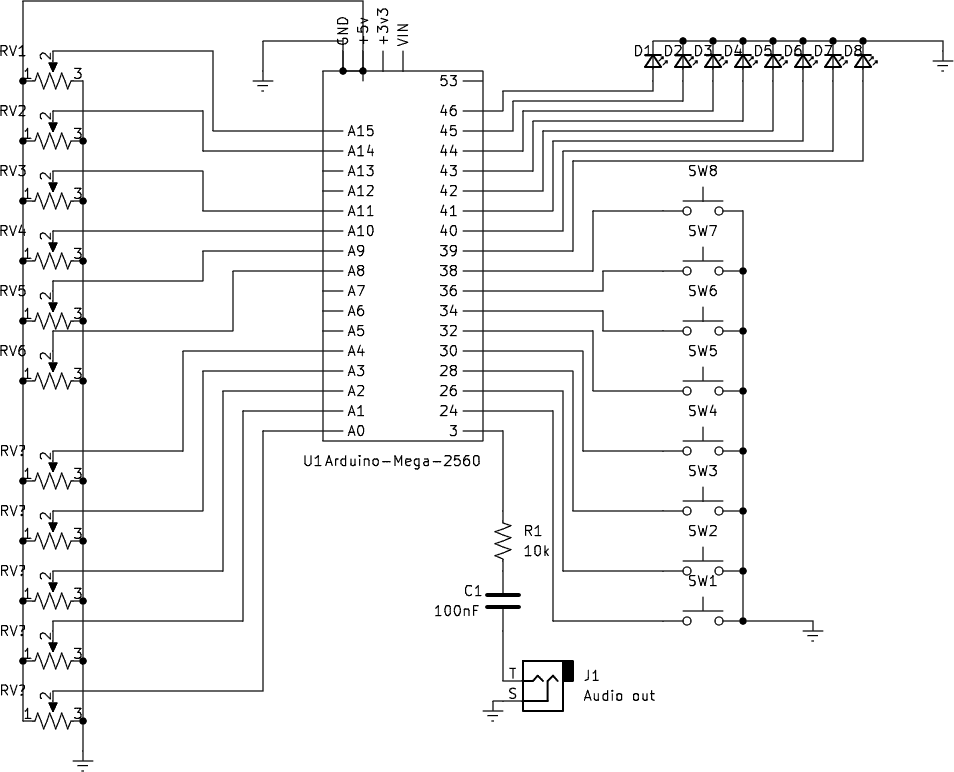

[Auduino synth](https://code.google.com/archive/p/tinkerit/wikis/Auduino.wiki) based on
[this](https://learn.sparkfun.com/tutorials/build-an-auduino-step-sequencer/all#buttons-and-knobs) sequencer mod.

Wire it like:

